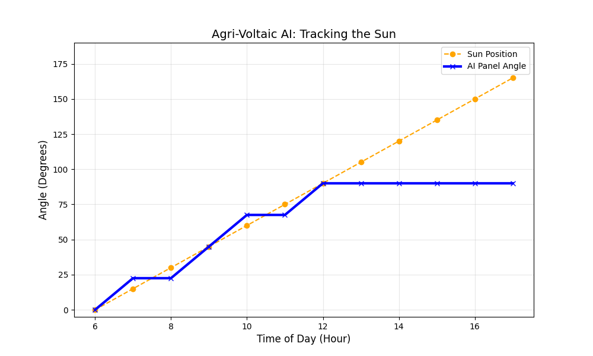

# Agri-Voltaic Optimization Agent 🌻⚡


A Reinforcement Learning (RL) project that optimizes the tilt angle of solar panels in an "Agri-Voltaic" farm—balancing maximum electricity generation with the light requirements of crops below.

## 📌 Project Overview
Agri-voltaics is the co-location of agriculture and solar photovoltaic panels. A major challenge in this field is control:
* **Solar Panels** want to face the sun directly (max shade).
* **Crops** need specific amounts of sunlight (photosynthesis) but can be damaged by too much heat.

This project trains an autonomous AI agent to dynamically adjust panel angles hourly to maximize **Total Economic Value** (Energy Revenue + Crop Yield).

## 🧠 The Solution
I built a custom OpenAI Gym environment and trained an agent using **Proximal Policy Optimization (PPO)**.

* **Environment:** Custom `AgriVoltaicEnv` (Gymnasium)
* **Algorithm:** PPO (Stable Baselines3)
* **Action Space:** Discrete (5 tilt angles: 0°, 22.5°, 45°, 67.5°, 90°)
* **Observation Space:** Sun Position, Soil Moisture, Crop Health Index.

## 📊 Results
The agent successfully learned to track the sun during peak hours while managing trade-offs.



* **Morning/Noon:** The agent aggressively tracks the sun (Blue line follows Orange line) to maximize energy revenue.
* **Afternoon Constraint:** As the sun moves past the physical limit of the panels (90°), the agent maintains the maximum possible angle to capture remaining light without resetting to 0° (which would lose all energy).

## 🛠️ Tech Stack
* **Python**
* **Gymnasium** (Custom Environment Design)
* **Stable Baselines3** (PPO Implementation)
* **NumPy** (Physics Simulation)
* **Matplotlib** (Data Visualization)

## 🚀 How to Run
1.  **Clone the repository**
    ```bash
    git clone https://github.com/vedadriharith/Agri-Voltaic-Optimization-Agent.git(https://github.com/vedadriharith/Agri-Voltaic-Optimization-Agent.git)
    cd agri-voltaic-agent
    ```

2.  **Install Dependencies**
    ```bash
    pip install gymnasium stable-baselines3 shimmy numpy matplotlib
    ```

3.  **Train the Agent**
    ```bash
    python train_agent.py
    ```
    *This will train the PPO model for 30,000 timesteps and save it as `ppo_agri_agent_v2.zip`.*

4.  **Visualize Results**
    ```bash
    python visualize.py
    ```
    *This runs a validation episode and generates the performance graph.*

## 📂 Project Structure
* `agri_env.py`: The custom physics simulation (Environment).
* `train_agent.py`: The training script using PPO.
* `visualize.py`: Evaluation script to plot Sun Angle vs. Panel Angle.

---
*Built as a portfolio project to explore Multi-Objective Optimization in Reinforcement Learning.*
